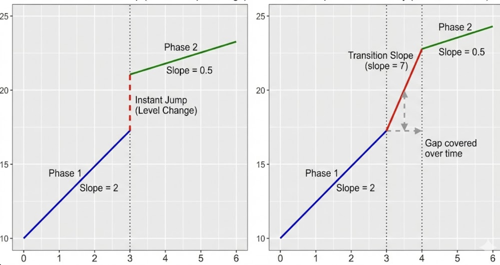
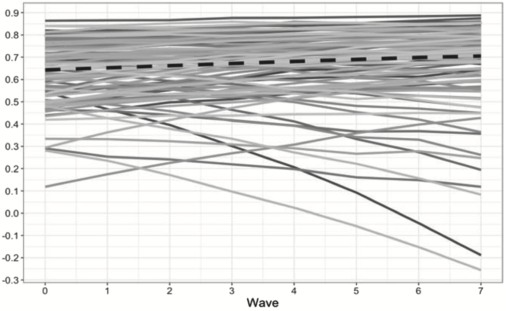

## Trajectories that bend

```{r}
library(tidyverse)
library(lavaan)
library(modelr)
library(lme4)
```

-   Thus far we have been sticking with monotonically increasing trajectories. This is a good assumption given the amount of data often found, along with the simplicity.

-   Often we want to see if trajectories are not straight. Development is not simple so our lines should not be.

-   Need effective strategies for line that bend that also balance trade offs with interpretability and overfitting

## Polynomial 

Polynomials (quadratic) level 1: $${Y}_{ti} = \beta_{0i}  + \beta_{1i}(Time_{ti} - \bar{X)} + \beta_{2i}(Time_{ti} - \bar{X)}^2 + \varepsilon_{ti}$$

Level 2: $${\beta}_{0i} = \gamma_{00} +   U_{0j}$$

$${\beta}_{1i} = \gamma_{10} +  U_{1j}$$ $${\beta}_{2i} = \gamma_{20} +  U_{2i}$$

## MLM poly example

```{r}
#| code-fold: true
personality <- read.csv("https://raw.githubusercontent.com/josh-jackson/longitudinal-2022/main/Subject_personality.csv")

ggplot(personality,
   aes(x = neodate, y = neuroticism, group = mapid)) + geom_line()  

```

------------------------------------------------------------------------

```{r}
#| code-fold: true
personality<- personality %>% 
  group_by(mapid) %>%
  arrange(neodate) %>% 
  dplyr::mutate(wave = seq_len(n())) 
```

```{r}
#| code-fold: true
ggplot(personality,
   aes(x = wave, y = neuroticism, group = mapid)) + geom_line()  

```

------------------------------------------------------------------------

Think about what time means both in terms of your model but how you structure your data. 

- What does the intercept mean? How does that impact random effects? Etc...

```{r}
#| code-fold: true
personality$neodate <- as.Date(personality$neodate, origin = "1900-01-01")

ggplot(personality,
   aes(x = neodate, y = neuroticism, group = mapid)) + geom_line()  


```

------------------------------------------------------------------------

```{r}
#| code-fold: true
# yes this code could be done more efficiently
personality.wide <- personality %>% 
  dplyr::select(mapid, wave, neodate) %>% 
  spread(wave, neodate) 

personality.wide$wave_1 <- personality.wide$'1'
personality.wide$wave_2 <- personality.wide$'2'
personality.wide$wave_3 <- personality.wide$'3'
personality.wide$wave_4 <- personality.wide$'4'
personality.wide$wave_5 <- personality.wide$'5'

personality.wide <- personality.wide %>% 
mutate (w_1 = (wave_1 - wave_1)/365,
          w_2 = (wave_2 - wave_1)/365,
          w_3 = (wave_3 - wave_1)/365,
          w_4 = (wave_4 - wave_1)/365,
        w_5 = (wave_5 - wave_1)/365)

personality.long <- personality.wide %>% 
  dplyr::select(mapid, w_1:w_5) %>% 
  gather(wave, year, -mapid) %>% 
  separate(wave, c('weeks', 'wave' ), sep="_") %>% 
 dplyr::select(-weeks) 

personality.long$wave <-  as.numeric(personality.long$wave)


personality <- personality %>% 
   left_join(personality.long, by = c('mapid', 'wave' )) 

personality.s <- personality %>% 
  group_by(mapid) %>% 
  tally() %>% 
   filter(n >=2) 

 personality <- personality %>% 
   filter(mapid %in% personality.s$mapid)

personality <- personality %>% 
  select(-neodate)
 
personality
```

------------------------------------------------------------------------

```{r}

p1 <- lmer(extraversion ~ year + (year | mapid), data=personality)
summary(p1)
```


---------

```{r}

p1b <- lmer(extraversion ~ wave + (wave | mapid), data=personality)
summary(p1b)
```


---------

Much smaller random effects; Less variance explained by predictors. 

```{r}

p1c <- lmer(extraversion ~ age + (age | mapid), data=personality)
summary(p1c)
```


------------------------------------------------------------------------

quadratic

```{r, eval = FALSE}
p2 <- lmer(extraversion ~ year + I(year^2) + (1 + year  | mapid), data=personality)
```

I() wont work on difftime objects. Booo

------------------------------------------------------------------------

quadratic

```{r}

personality <- personality %>% 
  mutate(year = as.numeric(year))

p2 <- lmer(extraversion ~ year + I(year^2) + (1 + year | mapid), data=personality)
```

------------------------------------------------------------------------

```{r}
summary(p2)
```

------------------------------------------------------------------------

#### The importance of centering

-   This is an interaction model, where you have a level 1 interaction. As such, centering is important to correctly interpret parameters.

------------------------------------------------------------------------

```{r}
personality <- personality %>% 
  mutate(year.c = year - 3.10)

p3 <- lmer(extraversion ~ year.c + I(year.c^2) + (1 + year.c | mapid), data=personality)
```

------------------------------------------------------------------------

```{r}
summary(p3)
```

------------------------------------------------------------------------

graphically, what does this look like?

```{r}
#| code-fold: true
personality %>% 
  data_grid(year.c = seq(-3.1,10, 1), .model = personality) %>%
  modelr::add_predictions(p3) %>% 
   group_by(year.c) %>% 
  dplyr::summarize(pred = mean(pred)) %>% 
  ggplot(aes(x = year.c, y = pred)) +
  geom_line()

```

------------------------------------------------------------------------

non-centered model

```{r}
#| code-fold: true
personality %>% 
  data_grid(year = seq(0,13, 1), .model = personality) %>% 
  add_predictions(p2) %>% 
   group_by(year) %>% 
  dplyr::summarize(pred = mean(pred)) %>% 
  ggplot(aes(x = year, y = pred)) +
  geom_line()

```

------------------------------------------------------------------------

```{r}
#| code-fold: true
personality %>% 
  data_grid(year.c = seq(-4,10, 1), .model = personality) %>% 
  add_predictions(p3) %>% 
  ggplot(aes(x = year.c, y = pred, group = mapid)) +
  geom_line(alpha = .15)

```

------------------------------------------------------------------------

compare with a linear model

```{r}
anova(p3, p1)
```


## SEM poly example

```{r}
#| code-fold: true

#use alcohol data from before
alcohol <- read.csv("https://raw.githubusercontent.com/josh-jackson/longitudinal-2022/main/alcohol1_pp.csv")

alcohol.wide <- alcohol %>% 
  dplyr::select(-X, -age_14, -ccoa) %>% 
  pivot_wider(names_from = "age", 
              names_prefix = "alcuse_",
              values_from  = alcuse) 
alcohol.wide
```

------------------------------------------------------------------------

```{r}
#| code-fold: true

model.4 <- '  

i =~ 1*alcuse_14 + 1*alcuse_15 + 1*alcuse_16 
s =~ 0*alcuse_14 + 2*alcuse_15 + 4*alcuse_16
q =~ 0*alcuse_14 + 4*alcuse_15 + 16*alcuse_16  

q~~0*q

alcuse_14~~a*alcuse_14
alcuse_15~~a*alcuse_15
alcuse_16~~a*alcuse_16
'

p4 <- growth(model.4, data = alcohol.wide, missing = "ML")

```

## centering in SEM

Because we control the scaling of time via our constraints we do not need to explicitly center time in the same way we did in the MLM model

------------------------------------------------------------------------

```{r}
summary(p4)
```

------------------------------------------------------------------------

Lets use the personality data from the mlm above. First gotta convert into wide.

```{r}
#| code-fold: true
personality2 <- read.csv("https://raw.githubusercontent.com/josh-jackson/longitudinal-2022/main/Subject_personality.csv")

p.wide<- personality2 %>% 
  group_by(mapid) %>%
  arrange(neodate) %>% 
  dplyr::mutate(wave = seq_len(n())) %>% 
  select(-c(age:neuroticism), -c(openness:gender)) %>% 
  pivot_wider(names_from = "wave", values_from = "extraversion",names_prefix = "extra_")

p.wide
```

------------------------------------------------------------------------

```{r}

model.5 <- '  

i =~ 1*extra_1 + 1*extra_2 + 1*extra_3 + 1*extra_4 + 1*extra_5 
s =~ 0*extra_1 + 1*extra_2 + 2*extra_3 + 3*extra_4 + 4*extra_5 
q =~ 0*extra_1 + 1*extra_2 + 4*extra_3 + 9*extra_4 + 16*extra_5  

'

p5 <- growth(model.5, data = p.wide, missing = "ML")

```

------------------------------------------------------------------------

```{r}
summary(p5, fit.measures = TRUE, standardize = TRUE)
```

------------------------------------------------------------------------

constrain variances

```{r}

model.6 <- '  

i =~ 1*extra_1 + 1*extra_2 + 1*extra_3 + 1*extra_4 + 1*extra_5 
s =~ 0*extra_1 + 1*extra_2 + 2*extra_3 + 3*extra_4 + 4*extra_5 
q =~ 0*extra_1 + 1*extra_2 + 4*extra_3 + 9*extra_4 + 16*extra_5  

extra_1 ~~ Q*extra_1
extra_2 ~~ Q*extra_2
extra_3 ~~ Q*extra_3
extra_4 ~~ Q*extra_4
extra_5 ~~ Q*extra_5
'

p6 <- growth(model.6, data = p.wide, missing = "ML")

```

------------------------------------------------------------------------

```{r}
summary(p6, fit.measures = TRUE, standardize = TRUE)
```

------------------------------------------------------------------------

```{r}
head(lavPredict(p6,type="lv"))
```

------------------------------------------------------------------------

```{r}
head(lavPredict(p6,type="ov"))
```

------------------------------------------------------------------------

```{r}
#| code-fold: true
as_tibble(lavPredict(p6,type="ov")) %>% 
  rowid_to_column("ID") %>% 
  pivot_longer(cols = starts_with("extra"), names_to = c(".value", "wave"), names_sep = "_") %>%
dplyr::mutate(wave = as.numeric(wave)) %>% 
ggplot(aes(x = wave, y = extra, group = ID, color = factor(ID))) +
  geom_line(alpha = .2) +  theme(legend.position = "none") 
```

## SEM latent basis

- Let the model decide the loadings, much as we would do with normal CFAs. 

- T1 Loading: 0 (Fixed - Baseline)
- T2 Loading: 0.75 (Estimated) "75% of the total change happened in the first year
- T3 Loading: 0.90 (Estimated) "By year 3, 90% of the total change occurred.
- T4 Loading: 1.0 (Fixed - End)


## SEM latent basis

```{r}

#| code-fold: true
model.7 <- '  

i =~ 1*extra_1 + 1*extra_2 + 1*extra_3 + 1*extra_4 + 1*extra_5 
s =~ 0*extra_1 + extra_2 + extra_3 + extra_4 + 1*extra_5 

'

p7 <- growth(model.7, data = p.wide, missing = "ML")

```

------------------------------------------------------------------------

```{r}
summary(p7, fit.measures = TRUE, standardize = TRUE)
```

------------------------------------------------------------------------

```{r}
#| code-fold: true
as_tibble(lavPredict(p7,type="ov")) %>% 
  rowid_to_column("ID") %>% 
  pivot_longer(cols = starts_with("extra"), names_to = c(".value", "wave"), names_sep = "_") %>%
dplyr::mutate(wave = as.numeric(wave)) %>% 
ggplot(aes(x = wave, y = extra, group = ID, color = factor(ID))) +
  geom_line(alpha = .2) +  theme(legend.position = "none") 
```


------------

- With three repeated assessments you will have a just identified model and thus cannot look at fit stats. It is more descriptive.

- Slope variance describes variance in total change. Note that the latent basis shape is assumed to fit for everyone! I.e. proportion of total change inbetween 1 and 2 must be the same for everyone, even if you are going up vs down 


------------------------------------------------------------------------

## Piecewise

-   Fit more than 1 trajectory

-   Best to use when we have a reason for a qualitative difference at a time point. For example, before your health event you may have a different trajectory than after

-   Time modeled as dummy variables that represent different segments

-   The point of separation is called a knot. You can have as many as you want and these can be pre-specified or let the data specify

------------------------------------------------------------------------

#### two-rate specification

-   The easiest example is to take your time variable and transform it into a Time1 and time2, that represent the different time periods

```{r}
t1 <- tribble(
  ~time, ~t0, ~t1,~t2,~t3,~t4,~t5,
  "time 1", 0, 1,2,2,2,2,
  "time 2", 0, 0,0,1,2,3
)
t1
```

-   Once you hit the knot your value stays the same. For the second curve, until you get to knot you don't have a trajectory.

------------------------------------------------------------------------

#### incremental curves

-   Here the first trajectory keeps going, whereas the second trajectory starts at the position of the knot.

```{r}
t2 <- tribble(
  ~time, ~t0, ~t1,~t2,~t3,~t4,~t5,
  "time 1", 0, 1,2,3,4,5,
  "time 2", 0, 0,0,1,2,3
)
t2
```

------------------------------------------------------------------------

-   The two coding schemes propose the same type of trajectory, the difference is in interpretation.
-   In the first, the two slope coefficients represent the actual slope in the respective time period.
-   In the second, the coefficient for time 2 represents the deviation from the slope in period 1.

------------

```{r}
#| code-fold: true
text <-
  tibble(exper = c(5, 5, 0.5, 0.5, 1),
         lnw   = c(2.24, 2.2, 2, 1.96, 1.62),
         label = c("Slope~differential",
                   "Pre-Post~knot~(gamma[2][italic(i)])",
                   "Rate~of~change",
                   "Pre~knot~(gamma[1][italic(i)])",
                   "DV~at~time~0(gamma[0][italic(i)])"),
         hjust = c(.5, .5, 0, 0, 0))

arrow <-
  tibble(exper = c(5.2, 1.7, 1.7),
         xend  = c(9.1, 1.7, 0.05),
         lnw   = c(2.18, 1.93, 1.64),
         yend  = c(2.15, 1.84, 1.74))

p2 <-
  tibble(exper = c(0, 3, 3, 10),
         ged   = rep(0:1, each = 2)) %>% 
 tidyr::expand(model = letters[1:2],
         nesting(exper, ged)) %>% 
  mutate(postexp = ifelse(exper == 10, 1, 0)) %>% 
  mutate(lnw = case_when(
    model == "a" ~ 1.75 + 0.04 * exper,
    model == "b" ~ 1.75 + 0.04 * exper + 0.15 * postexp),
  model = fct_rev(model)) %>%
  
  plot(aes(x = exper, y = lnw)) +
  annotate(geom = "curve",
           x = 8.5, xend = 8.8,
           y = 2.195, yend = 2.109,
           arrow = arrow(length = unit(0.05, "inches"), type = "closed", ends = "both"),
           size = 1/4, linetype = 2, curvature = -0.85)+ xlab("time") +ylab("DV")
  
p2  
```


## mlm example

level 1:

$${Y}_{ti} = \beta_{0i}  + \beta_{1i}Time1_{ti} + \beta_{2i}Time2_{ti} + \varepsilon_{ti}$$

Level 2: $${\beta}_{0i} = \gamma_{00} +  U_{0i}$$

$${\beta}_{1i} = \gamma_{10} +  U_{1i}$$ $${\beta}_{2i} = \gamma_{20} +  U_{2i}$$

------------------------------------------------------------------------

0 1 2 2 2\
0 0 0 1 2

```{r}

personality$time1 <- dplyr::recode(personality$wave, '1' = 0 , '2' = 1,  '3' = 2, '4' = 2,'5' = 2)      
personality$time2 <- recode(personality$wave, '1' = 0 , '2' = 0,  '3' = 0, '4' = 1,'5' = 2) 


```

------------------------------------------------------------------------

```{r}
p7 <- lmer(extraversion ~ time1 + time2 + (time2 | mapid) , data=personality)
summary(p7)
```

------------------------------------------------------------------------

0 1 3 4 5 (Wave)\
0 0 0 1 2 (same as time 2 previously)

```{r}
p8 <- lmer(extraversion ~ wave + time2 + (time2  | mapid) , data=personality)
summary(p8)
```

## SEM example

0 1 2 2 2\
0 0 0 1 2

```{r}
two.rate <- 'i =~ 1*extra_1 + 1*extra_2 + 1*extra_3 + 1*extra_4 + 1*extra_5 
s1 =~ 0*extra_1 + 1*extra_2 + 2*extra_3 + 2*extra_4 + 2*extra_5 
s2 =~ 0*extra_1 + 0*extra_2 + 0*extra_3 + 1*extra_4 + 2*extra_5  
'

p8 <- growth(two.rate, data = p.wide, missing = "ML")


```

------------------------------------------------------------------------

```{r}
summary(p8, fit.measures = TRUE, standardize = TRUE)
```

------------------------------------------------------------------------

0 1 2 3 4\
0 0 0 1 2

```{r}
incremental <- 'i =~ 1*extra_1 + 1*extra_2 + 1*extra_3 + 1*extra_4 + 1*extra_5 
s1 =~ 0*extra_1 + 1*extra_2 + 2*extra_3 + 3*extra_4 + 4*extra_5 
s2 =~ 0*extra_1 + 0*extra_2 + 0*extra_3 + 1*extra_4 + 2*extra_5  
'

p9 <- growth(incremental, data = p.wide, missing = "ML")


```

------------------------------------------------------------------------

```{r}
summary(p9, fit.measures = TRUE, standardize = TRUE)
```

------------------------------------------------------------------------

```{r}
#| code-fold: true
as_tibble(lavPredict(p9,type="ov")) %>% 
  rowid_to_column("ID") %>% 
  pivot_longer(cols = starts_with("extra"), names_to = c(".value", "wave"), names_sep = "_") %>%
dplyr::mutate(wave = as.numeric(wave)) %>% 
ggplot(aes(x = wave, y = extra, group = ID, color = factor(ID))) +
  geom_line(alpha = .2) +  theme(legend.position = "none") 

```

------------------------------------------------------------------------

different model, same figure?

```{r}
#| code-fold: true
as_tibble(lavPredict(p8,type="ov")) %>% 
  rowid_to_column("ID") %>% 
  pivot_longer(cols = starts_with("extra"), names_to = c(".value", "wave"), names_sep = "_") %>%
dplyr::mutate(wave = as.numeric(wave)) %>% 
ggplot(aes(x = wave, y = extra, group = ID, color = factor(ID))) +
  geom_line(alpha = .2) +  theme(legend.position = "none") 

```

------------------------------------------------------------------------

## polynomial piecewise

$${Y}_{ti} = \beta_{0i}  + \beta_{1i}Time1_{ti} +  \beta_{2i}Time1_{ti}^2 + \beta_{3i}Time2_{ti} + \varepsilon_{ti}$$

Level 2: $${\beta}_{0i} = \gamma_{00} +  U_{0i}$$

$${\beta}_{1i} = \gamma_{10} +  U_{1i}$$ $${\beta}_{2i} = \gamma_{20} +  U_{2i}$$ $${\beta}_{3i} = \gamma_{30} +  U_{3i}$$

------------------------------------------------------------------------

you really should have more waves per piece to model piecewise polynomial, but hey lets try it:

```{r}
#| code-fold: true
two.rate.poly <- 'i =~ 1*extra_1 + 1*extra_2 + 1*extra_3 + 1*extra_4 + 1*extra_5 
s1 =~ -2*extra_1 + -1*extra_2 + 0*extra_3 + 0*extra_4 + 0*extra_5 
s2 =~ 0*extra_1 + 0*extra_2 + 0*extra_3 + 1*extra_4 + 2*extra_5  
s2poly =~ 0*extra_1 + 0*extra_2 + 0*extra_3 + 1*extra_4 + 4*extra_5 

extra_1 ~~ Q*extra_1
extra_2 ~~ Q*extra_2
extra_3 ~~ Q*extra_3
extra_4 ~~ Q*extra_4
extra_5 ~~ Q*extra_5

s2poly~~0*s2poly

'

p9 <- growth(two.rate.poly, data = p.wide, missing = "ML")


```

```{r}
summary(p9)
```

------------------------------------------------------------------------

```{r}
#| code-fold: true
as_tibble(lavPredict(p9,type="ov")) %>% 
  rowid_to_column("ID") %>% 
  pivot_longer(cols = starts_with("extra"), names_to = c(".value", "wave"), names_sep = "_") %>%
dplyr::mutate(wave = as.numeric(wave)) %>% 
ggplot(aes(x = wave, y = extra, group = ID, color = factor(ID))) +
  geom_line(alpha = .2) +  theme(legend.position = "none") 

```


## Discontinuity in level

-   The previous models modified time, and thus the trajectory. But level 1 predictors also modify the trajectory. 

```{r}
#| code-fold: true
library(tidyverse)
plot <- function(data, 
                            mapping, 
                            sizes = c(1, 1/4), 
                            linetypes = c(1, 2), 
                            ...) {
  
  ggplot(data, mapping) +
    geom_line(aes(size = model, linetype = model)) +
    geom_text(data = text,
              aes(label = label, hjust = hjust),
              size = 3, parse = T) +
    geom_segment(data = arrow,
                 aes(xend = xend, yend = yend),
                 arrow = arrow(length = unit(0.075, "inches"), type = "closed"),
                 size = 1/4) +
    scale_size_manual(values = sizes) +
    scale_linetype_manual(values = linetypes) +
    scale_x_continuous(expand = expansion(mult = c(0, 0.05))) +
    scale_y_continuous(breaks = 0:4 * 0.2 + 1.6, expand = c(0, 0)) +
    coord_cartesian(ylim = c(1.6, 2.4)) +
    theme(legend.position = "none",
          panel.grid = element_blank())
  
}

text <-
  tibble(exper = c(4.5, 4.5, 7.5, 7.5, 1),
         lnw   = c(2.24, 2.2, 1.82, 1.78, 1.62),
         label = c("Common~rate~of~change",
                   "Pre-Post~L1~Event~(gamma[1][italic(i)])",
                   "Elevation~differential",
                   "on~level~1~IV~(gamma[2][italic(i)])",
                   "DV~at~time~zero~(gamma[0][italic(i)])"),
         hjust = c(.5, .5, .5, .5, 0))

arrow <-
  tibble(exper = c(2.85, 5.2, 5.5, 1.7),
         xend  = c(2, 6.8, 3.1, 0.05),
         lnw   = c(2.18, 2.18, 1.8, 1.64),
         yend  = c(1.84, 2.08, 1.9, 1.74))

p1 <-
  tibble(exper = c(0, 3, 3, 10),
         ged   = rep(0:1, each = 2)) %>% 
  tidyr::expand(model = letters[1:2],
         nesting(exper, ged)) %>% 
  mutate(exper2 = if_else(ged == 0, 0, exper - 3)) %>% 
  mutate(lnw = case_when(
    model == "a" ~ 1.75 + 0.04 * exper,
    model == "b" ~ 1.75 + 0.04 * exper + 0.05 * ged),
  model = fct_rev(model)) %>%
  plot(aes(x = exper, y = lnw))+ xlab("time") +ylab("DV")
p1

```

--------------


level 1:

$${Y}_{ti} = \beta_{0i}  + \beta_{1i}Time_{ti} + \beta_{2i}Switch_{ti} + \varepsilon_{ti}$$

Level 2: $${\beta}_{0i} = \gamma_{00} +  U_{0i}$$

$${\beta}_{1i} = \gamma_{10} +  U_{1i}$$ 
$${\beta}_{2i} = \gamma_{20} +  U_{2i}$$


## Discontinuity in Level and Slope


level 1:

$${Y}_{ti} = \beta_{0i}  + \beta_{1i}Time1_{ti} + \beta_{2i}Switch_{ti} + \beta_{3i}Time2_{ti} + \varepsilon_{ti}$$

Level 2: $${\beta}_{0i} = \gamma_{00} +  U_{0i}$$

$${\beta}_{1i} = \gamma_{10} +  U_{1i}$$ 
$${\beta}_{2i} = \gamma_{20} +  U_{2i}$$
$${\beta}_{3i} = \gamma_{20} +  U_{2i}$$

## Three-Phase Piecewise Model





---------------------------

Same model as before, just time is coded differently. You effectively have two knots, and then connect the knots. One knot is the end of the first trajectory, whereas the second is the start of the other trajectory.  

----------

knot between w3 and w4. 

```{r}
t3 <- tribble(
  ~time, ~t0,~t1,~t2,~t3,~t4,~t5,~t6,
  "time 1", 0,1,2,3,3,3,3,
  "transition", 0,0, 0,0,1,1,1,
  "time 2", 0, 0,0,0,0,1,2
)
t3
```


## Generalized growth curves

-   Often times your DV is not assumed to be governed by a normal data generating process. For example, we are working with count variables, or with dichotomous variables. 

- Just like with regression, you would fit different response distribution (binomial, poisson, beta, etc) and then use a link function to create a linear formula. 

- These same techniques can be applied to MLMs and thus longitudinal MLMs. 


-------


$$y_i \sim \operatorname{Bernoulli}(p_i)$$
$$p_i = \operatorname{logit}^{-1}(b_0)$$
$$\operatorname{logit}(x) = \log \left ( \frac{x}{1 - x} \right )$$

------


$$y_{ij}  \sim \operatorname{Bernoulli}(p_{ij}) \\$$
$$\operatorname{logit}(p_{ij})  = \gamma_{00} + \gamma_{10} \text{time}_{ij} + [\text{U}_{0j} + \text{U}_{1j} \text{time}_{ij}]$$

--------

```{r}
#| code-fold: true
library(dplyr)
dogs <- read.csv("~/Library/CloudStorage/Box-Box/5165 Applied Longitudinal Data Analysis/2024/dogs.txt", sep="") %>% rename(dog = Dog)
dogs
```

-----

```{r}
#| code-fold: true
dogs <-
  dogs %>% 
  pivot_longer(-dog, values_to = "y") %>% 
  mutate(trial = str_remove(name, "t") %>% as.double()) 
dogs
```

--------

```{r}
#| code-fold: true
# define the dog subset
set.seed(6)

subset <- sample(1:30, size = 8)

# subset the data
dogs %>% 
  filter(dog %in% subset) %>% 

  # plot!
  ggplot(aes(x = trial, y = y)) +
  geom_point() +
  scale_y_continuous(breaks = 0:1) +
  theme(panel.grid = element_blank()) +
  facet_wrap(~ dog, ncol = 4, labeller = label_both)
```


-------

```{r}
library(brms)
growth.log <- 
  brm(data = dogs,
      family = bernoulli,
      y ~ 0 + Intercept + trial + (1 + trial | dog),
      prior = c(prior(normal(-2, 1), class = b, coef = Intercept),
                prior(normal(0.25, 0.25), class = b),
                prior(exponential(1), class = sd),
                prior(lkj(4), class = cor)),
      iter = 2000, warmup = 1000, cores = 3, chains = 3,
      seed = 6,
      backend = "cmdstanr",
      file = "growth.log")
```

------

```{r}
summary(growth.log)
```


------

```{r}
conditional_effects(growth.log)
```


---------

The probability that an unfamiliar listener understands what a child says, develops from age 3 to age 8. Example pulled from T.J. Mahr's website

Proportions, bounded by 0 - 1. Nonlinear in that they are going to be logistic shapped. 

```{r}
#| code-fold: true
library(tidyverse)
points <- tibble(
  age = c(38, 45, 52, 61, 80, 74), 
  prop = c(0.146, 0.241, 0.571, 0.745, 0.843, 0.738))

colors <- list(
  data = "#41414550",
  fit = "#414145")

ggplot(points) + 
  aes(x = age, y = prop) + 
  geom_point(size = 3.5, color = colors$data) +
  scale_x_continuous(
    name = "Age in months", 
    limits = c(0, 96), 
    # Because age is in months, I want breaks to land on multiples
    # of 12. The `Q` in `extended_breaks()` are "nice" numbers to use
    # for axis breaks.
    breaks = scales::extended_breaks(Q = c(24, 12))) + 
  scale_y_continuous(
    name = "Intelligibility",
    limits = c(0, NA),
    labels = scales::percent_format(accuracy = 1))
```


-----------

```{r}
#| code-fold: true
xs <- seq(0, 96, length.out = 80)

# Create the curve from the equation parameters
trend <- tibble(
  age = xs,
  asymptote = .8,
  scale = .2,
  midpoint = 48,
  prop = asymptote / (1 + exp((midpoint - age) * scale)))

ggplot(points) + 
  aes(x = age, y = prop) + 
  geom_line(data = trend, color = colors$fit) +
  geom_point(size = 3.5, color = colors$data) +
  scale_x_continuous(
    name = "Age in months", 
    limits = c(0, 96), 
    breaks = scales::extended_breaks(Q = c(24, 12))) + 
  scale_y_continuous(
    name = "Intelligibility",
    limits = c(0, NA),
    labels = scales::percent_format(accuracy = 1))
```


-------

```{r}
#| code-fold: true
#| 
colors$asym <- "#E7552C"
colors$mid <- "#3B7B9E"
colors$scale <- "#1FA35C"

p <- ggplot(points) +
  aes(x = age, y = prop) +
  annotate(
    "segment",
    color = colors$mid,
    x = 48, xend = 48,
    y = 0, yend = .4,
    linetype = "dashed") +
  annotate(
    "segment",
    color = colors$asym,
    x = 20, xend = Inf,
    y = .8, yend = .8,
    linetype = "dashed") +
  geom_line(data = trend, size = 1, color = colors$fit) +
  geom_point(size = 3.5, color = colors$data) +
  annotate(
    "text",
    label = "growth plateaus at asymptote",
    x = 20, y = .84,
    # horizontal justification = 0 sets x position to left edge of text
    hjust = 0,
    color = colors$asym) +
  annotate(
    "text",
    label = "growth steepest at midpoint",
    x = 49, y = .05,
    hjust = 0,
    color = colors$mid) +
  scale_x_continuous(
    name = "Age in months", 
    limits = c(0, 96), 
    breaks = scales::extended_breaks(Q = c(24, 12))) + 
  scale_y_continuous(
    name = "Intelligibility",
    limits = c(0, NA),
    labels = scales::percent_format(accuracy = 1))

p
```


-------

$$f(t) = \frac{\text{asymptote}}{1 + \exp{((\text{mid}~-~t)~*~\text{scale})}}$$


------

```{r}
#| code-fold: true
#| 
annotate_eq <- function(label, ...) {
  annotate("text", x = 0, y = .6, label = label, parse = TRUE, 
           hjust = 0, size = 4, ...)
}

slope <- (.2 / 4) * .8
x_step <- 2.5
y1 <- .4 + slope * -x_step
y2 <- .4 + slope * x_step

p <- p +
  geom_segment(
    x = 48 - x_step, xend = 48 + x_step,
    y = y1, yend = y2,
    size = 1.2,
    color = colors$scale,
    arrow = arrow(ends = "both", length = unit(.1, "in"))) +
  annotate(
    "text",
    label = "scale controls slope of curve",
    x = 49, y = .38, 
    color = colors$scale, hjust = 0)

# p + annotate_eq(
#     label = "f(t)==frac(asymptote, 1 + exp((mid-t)%*%scale))", 
#     color = colors$fit)

p1 <- p +
  annotate_eq(
    label = "
    f(t) == frac(
      phantom(asymptote), 
      1 + exp((phantom(mid) - t) %*% phantom(scale))
    )",
    color = colors$fit) 

p2 <- p1 + 
  annotate_eq(
    label = "
    phantom(f(t) == symbol('')) ~ atop(
      asymptote, 
      phantom(1 + exp((mid-t) %*% scale))
    )",
    color = colors$asym)

p2 +
  annotate_eq(
    label = "
    phantom(f(t) == symbol('')) ~ atop(
      phantom(asymptote), 
      phantom(1 + exp((mid-t) * symbol(''))) ~ scale
    )",
    color = colors$scale) +
  annotate_eq(
    label = "
    phantom(f(t) == symbol('')) ~ atop(
      phantom(asymptote), 
      paste(
        phantom(paste(1 + exp, symbol(')'), symbol(')'))),
        mid,
        phantom(paste(symbol('-'), t, symbol(')') * scale))
      )
    )",
    color = colors$mid)

```


----------

```{r}
#| code-fold: true
library(brms)

data <- tibble(
  age = c(38, 45, 52, 61, 80, 74), 
  prop = c(0.146, 0.241, 0.571, 0.745, 0.843, 0.738)
)

inv_logit <- function(x) 1 / (1 + exp(-x))

model_formula <- bf(
  # Logistic curve
  prop ~ inv_logit(asymlogit) * inv(1 + exp((mid - age) * exp(scale))),
  # Each term in the logistic equation gets a linear model
  asymlogit ~ 1,
  mid ~ 1,
  scale ~ 1,
  # Precision
  phi ~ 1,
  # This is a nonlinear Beta regression model
  nl = TRUE, 
  family = Beta(link = identity)
)

prior_fixef <- c(
  # Point of steepest growth is age 4 plus/minus 2 years
  prior(normal(48, 12), nlpar = "mid", coef = "Intercept"),
  prior(normal(1.25, .75), nlpar = "asymlogit", coef = "Intercept"),
  prior(normal(-2, 1), nlpar = "scale", coef = "Intercept")
)

prior_phi <- c(
  prior(normal(2, 1), dpar = "phi", class = "Intercept")
)

fit <- brm(
  model_formula,
  data = data,
  prior = c(prior_fixef, prior_phi),
  iter = 2000,
  chains = 4,
  cores = 1,
  control = list(adapt_delta = 0.9, max_treedepth = 15), 
  seed = 20211014,
  file = "glm_growth_curve",
  backend = "cmdstanr",
  refresh = 0
)

draws_posterior <- data %>%
  tidyr::expand(age = 0:100) %>%
  tidybayes::add_epred_draws(fit, ndraws = 100) 
```

---------

```{r}
summary(fit)
```


------

```{r}
#| code-fold: true
library(tidybayes)
ggplot(draws_posterior) +
  aes(x = age, y = .epred) +
 stat_lineribbon(.width = .95, alpha = .2) +
  geom_point(
    aes(y = prop), 
    data = data
  ) +
  expand_limits(y = 0:1)
```


## Non-linear models

Standard GLM can be written this way, which reflects a linear combination 
$$ \eta_n = \sum_{i = 1}^K b_i x_{ni}$$

Nonlinear models cannot, such as: 
$$\eta_n = b_1 \exp(b_2 x_n)$$

- Many nonlinear functions exist, and can be used in standard regression. We can of course take these functions and apply them to longitudinal data. 

----

Insurance example
$$ \mu_{AY, dev} = ult_{AY}
\left(1 - \exp\left(- \left( \frac{dev}{\theta} \right)^\omega \right)
\right)$$ 

```{r}
data(loss)
head(loss)
```


------

```{r}
#| code-fold: true
fit_loss <- brm(
  bf(cum ~ ult * (1 - exp(-(dev/theta)^omega)),
     ult ~ 1 + (1|AY), omega ~ 1, theta ~ 1,
     nl = TRUE),
  data = loss, family = gaussian(),
  prior = c(
    prior(normal(5000, 1000), nlpar = "ult"),
    prior(normal(1, 2), nlpar = "omega"),
    prior(normal(45, 10), nlpar = "theta")),
  control = list(adapt_delta = 0.9),
  backend = "cmdstanr",
  file = "loss")
```


--------

```{r}
conditional_effects(fit_loss)
```

-----
```{r}
summary(fit_loss)
```


-------

Wright & Jackson, 2022 JPSP asymptoptic growth curve example

$$Y_{ij}=\ a_j-\left(a_j-\ b_j\right)\ast e^{\left(-c_j{time}_{ij}\right)}\ $$
$$b_j=\ \gamma_b0+\ U_bj$$
$$c_j=\ \gamma_{c0}+\ U_{cj}$$
$b_j$ can be thought of as the intercept, whereas $c_j$ is the slope. $a_j$ is maximum possible value

------




