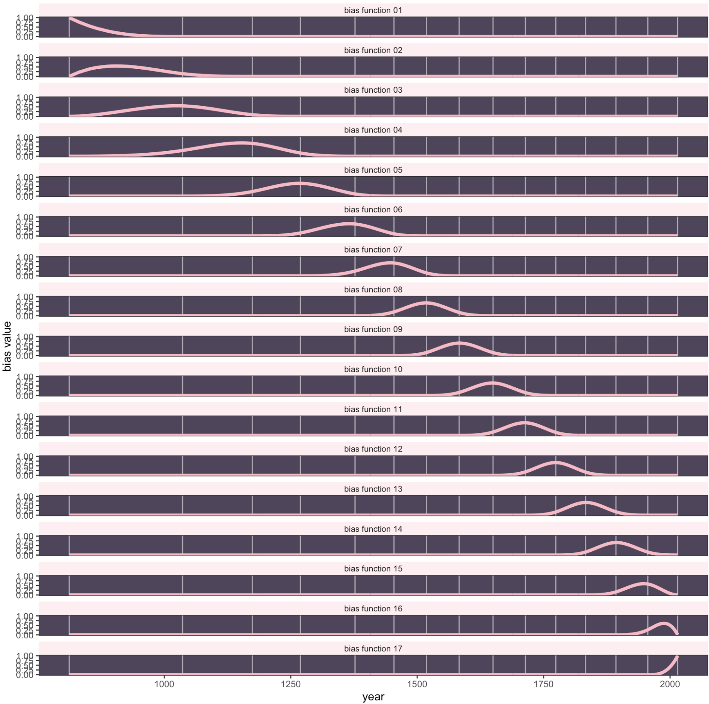

## Splines 

- Piecewise regression yields continuous functions which are not, generally, smooth. Regression with splines yields smooth continuous functions.

- A spline is essentially a Piecewise Polynomial but forces the ends of these pieces to meet perfectly smoothly so it looks like one continuous line. 

- A "spline" was a flexible strip of wood used by draftsmen to draw smooth curves through a set of points. We will do the same with several simple polynomial segments at specific points called knots

## knots 

We break the $x$-axis into multiple smaller regions. The specific points where we divide these regions are called knots.

Inside each region (between two knots), we fit a simple polynomial, usually a cubic (degree 3) function.

We must connect or touch each polynomial at the knot. Further, they must be smooth, non jerky transitions. 


## Build intuitions


```{r}
#| code-fold: true
library(ggplot2)
library(dplyr)
library(splines) 
set.seed(123) 
n_points <- 100
x <- seq(-10, 10, length.out = n_points)
y <- sin(x / 1.5) * 1.5 + rnorm(n_points, sd = 0.3)
df <- data.frame(x = x, y = y)

knots <- c(-10, -5, 0, 5, 10)
segments_df <- data.frame(
  x_start = knots[-length(knots)], 
  x_end = knots[-1],     
  bin_id = factor(1:(length(knots) - 1)) 
)

segments_df$y_mean <- apply(segments_df, 1, function(row) {
  x_s <- as.numeric(row["x_start"])
  x_e <- as.numeric(row["x_end"])
  if (x_e == max(knots)) {
    in_bin <- df$x >= x_s & df$x <= x_e
  } else {
    in_bin <- df$x >= x_s & df$x < x_e
  }
  mean(df$y[in_bin], na.rm = TRUE)
})

segment_colors <- c("#377eb8", "#ff7f00", "#4daf4a", "#e41a1c")

ggplot() +
  geom_point(data = df, aes(x = x, y = y), color = "black", size = 2) +
  geom_vline(aes(xintercept = knots, linetype = "Knot"), 
             color = "gray50", size = 0.8) +
  geom_segment(data = segments_df, 
               aes(x = x_start, xend = x_end, 
                   y = y_mean, yend = y_mean, 
                   color = bin_id), 
               size = 1.5) +
    scale_color_manual(values = segment_colors, guide = "none") + 
  scale_linetype_manual(name = "", values = c("Knot" = "dashed")) + 
  scale_x_continuous(breaks = seq(-10, 10, 5), limits = c(-10.5, 10.5)) +
  scale_y_continuous(breaks = seq(-2, 1, 1), limits = c(-2.2, 1.8)) +
  theme_bw() +
  theme(
    plot.title = element_text(size = 20, hjust = 0.5),
    axis.title = element_text(size = 18),
    axis.text = element_text(size = 14),
    legend.position = c(0.85, 0.5), 
    legend.text = element_text(size = 16),
    legend.key.width = unit(1.5, "cm"), 
    panel.grid.major = element_blank(),
    panel.grid.minor = element_blank()
  )
```

---------------

- What does this equation look like? 

- We are transforming our X variable into multiple "synthetic" variables. 

- Right now, think of this as categorizing a continuous varible. 


----------------

```{r}
#| code-fold: true
set.seed(123)
n_points <- 100
x <- seq(-10, 10, length.out = n_points)
y <- sin(x / 1.5) * 1.5 + rnorm(n_points, sd = 0.3)
df <- data.frame(x = x, y = y)
knots_all <- c(-10, -5, 0, 5, 10) 
knots_interior <- c(-5, 0, 5)
fit_linear <- lm(y ~ bs(x, knots = knots_interior, degree = 1), data = df)
df$pred_linear <- predict(fit_linear, newdata = df)

fit_cubic <- lm(y ~ bs(x, knots = knots_interior, degree = 3), data = df)
df$pred_cubic <- predict(fit_cubic, newdata = df)

create_spline_plot <- function(data, y_col, title, line_color) {
  ggplot(data, aes(x = x, y = y)) +
    geom_point(color = "black", size = 2) +
    geom_vline(xintercept = knots_all, linetype = "dashed", color = "gray50") +
    geom_line(aes_string(y = y_col), color = line_color, size = 1.5) +
    scale_x_continuous(breaks = knots_all, limits = c(-10.5, 10.5)) +
    labs(title = title, subtitle = "Vertical dashed lines = Knots") +
    theme_bw() +
    theme(
      plot.title = element_text(size = 18, face = "bold"),
      plot.subtitle = element_text(size = 14),
      axis.title = element_text(size = 14),
      panel.grid.minor = element_blank()
    )
}

plot_linear <- create_spline_plot(df, "pred_linear", "Linear Spline (Degree 1)", "#377eb8")
plot_linear

```


-----------

- How can we think of this equation? Same as before, but isntead of a 0,1 dummy varibale we are going to fit linear lines. Or similar to piecewise in that we are breaking up our predictor. 

- $$Y = B_{1}X_1 + B_{2}X_2 + B_{3}X_3 + \dots$$

Where $X_1$ = x if x is between -10, & -5, zero for all else. 

Where $X_2$ = x if x is between -5, & 0, zero for all else.

** technically this is not what is happening, as this does not lead to having our ends of each segment meet one another, but this transformation is a good starting point **


## Basis Functions

$$f(x) = \sum_{j=1}^{k} \beta_j \cdot \text{Basis}_j(x)$$

- Splines have Local effects rather than polynomials where the curve is across the entire range of X. To fit these local curves inbetween knots, we need to create a series of j basis functions to essential turn on and off the effect at different values of X across our different k knots.  


------------

```{r}
#| code-fold: true
library(splines)
library(ggplot2)
library(tidyr)
x2 <- seq(0, 10, length.out = 100)
internal_knots <- c(2.5, 5, 7.5)
basis_mat <- bs(x2, knots = internal_knots, degree = 1, intercept = TRUE)
basis_df <- as.data.frame(basis_mat)
basis_df$x2 <- x2
colnames(basis_df)[1:(ncol(basis_df)-1)] <- paste0("Basis_", 1:(ncol(basis_df)-1))
basis_long <- pivot_longer(basis_df, 
                           cols = starts_with("Basis"), 
                           names_to = "Tent", 
                           values_to = "Value")
ggplot(basis_long, aes(x = x2, y = Value, color = Tent)) +
  geom_line(size = 1.2) +
  geom_vline(xintercept = c(0, internal_knots, 10), 
             linetype = "dashed", color = "gray60") +
  scale_y_continuous(limits = c(0, 1.1), breaks = seq(0, 1, 0.2)) +
  labs(title = "Linear B-Spline Basis Functions (Tents)",
       subtitle = "Notice how each tent peaks at 1.0 at its knot and is 0.0 at all other knots.",
       x = "Independent Variable (X)",
       y = "Basis Function Value (Membership)") +
  theme_minimal() +
  theme(legend.position = "bottom")
```


--------------

```{r}
bs(x2, knots = internal_knots, degree = 1, intercept = TRUE)
```


-------

Normal regression has 1 function

We will have number of basis functions equal to: 

$\text{Internal Knots} + \text{Degree} + \text{Intercept}$

3 + 1 (linear) + intercept


-----------

```{r}
plot_linear
```


--------------------

The matrix is unpacked, much like a categorical variable into a dummy. You get something like: y ~ Column1 + Column2 + Column3 + Column4 + Column5 


```{r}
#| code-fold: true

i_knots <- c(-5, 0, 5)
basis_mat <- bs(x, knots = i_knots, degree = 1, intercept = TRUE)
lm1 <- lm(y ~ 0 + basis_mat, data = df) 
summary(lm1)
```


## B-splines 

Instead of hills we are going to work with hills (or bells, from cubic function, and thus "b" splines). 

```{r}
#| code-fold: true
plot_cubic <- create_spline_plot(df, "pred_cubic", "Cubic Spline (Degree 3)", "#e41a1c")
plot_cubic
```


------


3 (knots) + 3 (cubic) + intercept

```{r}
#| code-fold: true

basis_mat2 <- bs(x, knots = i_knots, degree = 3, intercept = TRUE)
basis_mat2

```


--------

```{r}
#| code-fold: true

basis_df <- as.data.frame(basis_mat2)
basis_df$x <- x
basis_long <- pivot_longer(basis_df, cols = -x, names_to = "Basis", values_to = "Value")

ggplot(basis_long, aes(x = x, y = Value, color = Basis)) +
  geom_line(size = 1) +
  geom_vline(xintercept = i_knots, linetype = "dashed", alpha = 0.5) +
  labs(title = paste("Basis Functions with", length(i_knots), "Internal Knots"),
       subtitle = paste("Total Basis Functions =", ncol(basis_mat))) +
  theme_minimal()

```


------

Basis functions. We are describing many different "hills" for each value of x via how many knots. 

How much does this specific hill overlap with this specific data point? 

For every data point we are dividing up the hills into a percent that is equal to 1. 


```{r}
basis_mat2
```

------------


```{r}
#| code-fold: true
model2 <- lm(y ~ 0 + basis_mat2) 
coefs<-coef(model2)
summary(model2)
```


------------

B is the basis and tells us where the hills are. 

$\beta_j$ tells us how tall the hills are (weights)

Multiplying together tells us the Weighted shapes

$$f(x) = \sum_{j=1}^{k} \beta_j \cdot B_j(x)$$


---------

```{r}
#| code-fold: true
scaled_basis <- basis_mat2 %*% diag(coefs)
basis_df <- as.data.frame(scaled_basis)
basis_df$x <- x
basis_df$Total_Curve <- rowSums(scaled_basis) 

basis_long <- basis_df %>%
  pivot_longer(cols = starts_with("V"), names_to = "Basis_Function", values_to = "Value")

ggplot() +
  geom_point(data = df, aes(x = x, y = y), alpha = 0.3) +
  geom_area(data = basis_long, aes(x = x, y = Value, fill = Basis_Function), 
            alpha = 0.5, position = "identity") +
  geom_line(data = basis_df, aes(x = x, y = Total_Curve), 
            color = "black", size = 1.5, linetype = "solid") +
  labs(title = "Anatomy of a Spline",
       subtitle = "Colored Areas = Weighted Basis Functions \nBlack Line = The Combination ",
       y = "Y") +
  theme_minimal() +
  theme(legend.position = "none")
```


## 50 knots

```{r}
#| code-fold: true
set.seed(123)
x <- seq(0, 10, length.out = 100)
y <- sin(x) + rnorm(100, sd = 0.2)
df <- data.frame(x = x, y = y)
basis_matrix <- bs(x, df = 50, intercept = TRUE) 
model <- lm(y ~ basis_matrix - 1) 
coeffs <- coef(model)
scaled_basis <- basis_matrix %*% diag(coeffs)
basis_df <- as.data.frame(scaled_basis)
basis_df$x <- x
basis_df$Total_Curve <- rowSums(scaled_basis) 
basis_long <- basis_df %>%
  pivot_longer(cols = starts_with("V"), names_to = "Basis_Function", values_to = "Value")

ggplot() +
  geom_point(data = df, aes(x = x, y = y), alpha = 0.3) +
  geom_area(data = basis_long, aes(x = x, y = Value, fill = Basis_Function), 
            alpha = 0.5, position = "identity") +
  geom_line(data = basis_df, aes(x = x, y = Total_Curve), 
            color = "black", size = 1.5, linetype = "solid") +
  theme_minimal() +
  theme(legend.position = "none")
```


---------

```{r}
summary(model)
```


## Basis dimension


- Low number results in less wiggliness. May be under fit

- High number results in more wiggliness. May over fit. 


## Cherry blossom data

```{r}
#| code-fold: true
#| 
library(rethinking)
data(cherry_blossoms)
d <- cherry_blossoms
rm(cherry_blossoms)
detach(package:rethinking, unload = T)

d %>% 
  ggplot(aes(x = year, y = doy)) +
  geom_point(color = "#ffb7c5", alpha = 1/2) +
  theme_bw() +
    theme(panel.background = element_rect(fill = "#4f455c"),
        panel.grid = element_blank())


```


--------

$$f(x) = w_1 B_{i, 1} + w_2 B_{i, 2} + w_3 B_{i, 3} + \dots$$

- B-splines invent a series of entirely new, synthetic predictor variables. The hills. Each of these synthetic variables exists only to gradually turn a specific parameter on and off within a specific range of the real predictor variable. 

- Each of the synthetic variables is called a basis function and serve as weights


## knots


```{r}
#| code-fold: true
d2 <-
  d %>% 
  drop_na(doy)

num_knots <- 15
knot_list <- quantile(d2$year, probs = seq(from = 0, to = 1, length.out = num_knots))

d %>% 
  ggplot(aes(x = year, y = doy)) +
  geom_vline(xintercept = knot_list, color = "white", alpha = 1/2) +
  geom_point(color = "#ffb7c5", alpha = 1/2) +
  theme_bw() +
  theme(panel.background = element_rect(fill = "#4f455c"),
        panel.grid = element_blank())
```

## Basis function


```{r}
#| code-fold: true
library(splines)
library(brms)
library(purrr)
library(stringr)
B <- bs(d2$year, knots = knot_list[-c(1, num_knots)], 
        degree = 3,  
        intercept = TRUE)
        
B %>% str()
knot_list[c(1, num_knots)]


b <-B %>% 
  data.frame() %>% 
  # set_names(str_c(0, 1:9), 10:17) %>%  
  bind_cols(dplyr::select(d2,year)) %>% 
  pivot_longer(-year,
               names_to = "bias_function",
               values_to = "bias")

# plot
b %>% 
  ggplot(aes(x = year, y = bias, group = bias_function)) +
  geom_vline(xintercept = knot_list, color = "white", alpha = 1/2) +
  geom_line(color = "#ffb7c5", alpha = 1/2, linewidth = 1.5) +
  ylab("bias value") +
  theme_bw() +
  theme(panel.background = element_rect(fill = "#4f455c"),
        panel.grid = element_blank())
```


---------





## estimation

```{r}
spline <- 
  brm(data = d3,
      family = gaussian,
      doy ~ 1 + B,
      prior = c(prior(normal(100, 10), class = Intercept),
                prior(normal(0, 10), class = b),
                prior(exponential(1), class = sigma)),
      iter = 2000, warmup = 1000, chains = 4, cores = 4,
      seed = 4,
      backend = "cmdstanr",
      file = "spline")
```

--------

The parameter estimates are very difficult to interpret directly. It’s often easier to just plot the results

```{r}
summary(spline)
```


---------


```{r}
#| code-fold: true
post <- as_draws_df(spline)

post %>% 
  dplyr::select(b_B1:b_B17) %>% 
  set_names(c(str_c(0, 1:9), 10:17)) %>% 
  pivot_longer(everything(), names_to = "bias_function") %>% 
  group_by(bias_function) %>% 
  summarise(weight = mean(value)) %>% 
  full_join(b, by = "bias_function") %>% 
  
  # plot
  ggplot(aes(x = year, y = bias * weight, group = bias_function)) +
  geom_vline(xintercept = knot_list, color = "white", alpha = 1/2) +
  geom_line(color = "#ffb7c5", alpha = 1/2, linewidth = 1.5) +
  theme_bw() +
  theme(panel.background = element_rect(fill = "#4f455c"),
        panel.grid = element_blank()) 
```


-------

```{r}
#| code-fold: true
f <- fitted(spline)

f %>% 
  data.frame() %>% 
  bind_cols(d2) %>% 
  
  ggplot(aes(x = year, y = doy, ymin = Q2.5, ymax = Q97.5)) + 
  geom_vline(xintercept = knot_list, color = "white", alpha = 1/2) +
  geom_hline(yintercept = fixef(spline)[1, 1], color = "white", linetype = 2) +
  geom_point(color = "#ffb7c5", alpha = 1/2) +
  geom_ribbon(fill = "white", alpha = 2/3) +
  labs(x = "year",
       y = "day in year") +
  theme_bw() +
  theme(panel.background = element_rect(fill = "#4f455c"),
        panel.grid = element_blank())
```


## GAMs

- Offer a solution to the regression spline issue of how many knots should we fit by utilizing penalized (regularized) splines. Plus more! 

-   GAMs offer a middle ground from simple lines to localized lowess curves: they can be fit to complex, nonlinear relationships and make good predictions in these cases, but we are still able to do inferential statistics and understand and explain the underlying structure of our models

## Generalized additive models

Similar to going from general linear model to generalized linear model. One more generalization.

$$y \sim ExpoFam(\mu, etc.)$$

$$ \mu = \beta_0  + \beta_1 (x)  $$
Instead of one coefficient per predictor, in GAMs we have many. 

$$f(x) = \sum_{j=1}^{k} \beta_j \cdot B_j(x)$$


## actual gam model

```{r}
spline2 <-
  brm(data = d2,
      family = gaussian,
      doy ~ 1 + s(year),
      prior = c(prior(normal(100, 10), class = Intercept),
                prior(normal(0, 10), class = b),
                prior(student_t(3, 0, 5.9), class = sds),
                prior(exponential(1), class = sigma)),
      iter = 2000, warmup = 1000, chains = 4, cores = 4,
      seed = 4,
      control = list(adapt_delta = .99),
      backend = "cmdstanr",
      file = "spline2")
```


------

```{r}
summary(spline2)
```

--------

```{r}
#| code-fold: true
fitted(spline2) %>% 
  data.frame() %>% 
  bind_cols(dplyr::select(d2, year, doy)) %>% 
  
  ggplot(aes(x = year, y = doy, ymin = Q2.5, ymax = Q97.5)) +
  geom_hline(yintercept = fixef(spline2)[1, 1], color = "white", linetype = 2) +
  geom_point(color = "#ffb7c5", alpha = 1/2) +
  geom_ribbon(fill = "white", alpha = 2/3) +
  labs(subtitle = "b4.7 using s(year)",
       y = "day in year") +
  theme_bw() +
  theme(panel.background = element_rect(fill = "#4f455c"), 
        panel.grid = element_blank())
```


## Penalized estimation

-   One concern is that we overfit our data and make our lines too wiggly. We can overcome this via penalized estimation, basically balancing minimizing residuals with out of sample prediction.

-   This is what is used in lasso or ridge regression or many other machine learning algorithms.

-   A penalization parameter often called lambda uses cross validation to balance over vs under fitting