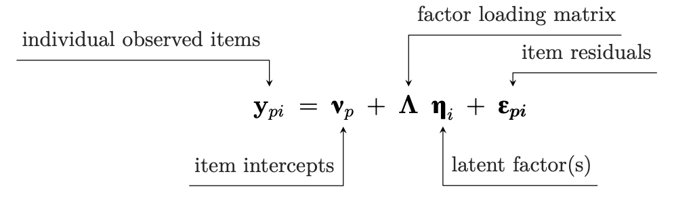
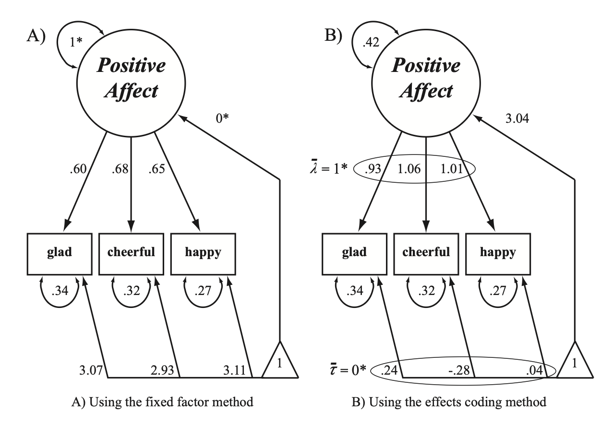
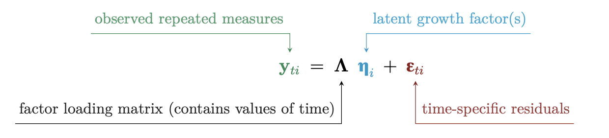

## Longitudinal Structural Equation Modeling

```{r, echo=FALSE}
library(lavaan)
library(semPlot)
library(readr)
```

SEM is the broader umbrella from the GLM. With it we are able to do two interesting this:

1.  Fit a latent measurement model (e.g., CFA)

2.  Fit a structural model (e.g,. path analysis)

These two components allow us to address more difficult research questions involving but not limited to: multiple DVs, mediators, varying effects across time, unmeasured variables, constraints, and measurement invariance.

-----------

| | **Nature of the Latent Variable: Categorical** | **Nature of the Latent Variable: Metrical** |
| :--- | :--- | :--- |
| **Manifest Variable: Categorical** | Latent transition analysis | Latent trait analysis; IRT |
| **Manifest Variable: Metrical** | Latent class; Mixture modeling | Latent variable analysis; CFA |


## SEM terminology

-   Indicators or items or manifest variables

    -   Represented by squares in path diagrams

-   Latent or unobserved

    -   Represented by circles

## Path diagrams

Circles = latent variables

Boxes = observed indicator variables

Two headed arrows = correlations/covariances/variances

Single head arrows = regressions

Triangle = means


------------

```{r}
#| code-fold: true

# generate data dataset:
X <- rnorm(100, 5, 5)
M <- rnorm(100)
Y <- rnorm(100, 0, 1) 
data <- data.frame(X, Y, M)

res1 <- 'Y ~  1 + X'

fit.1 <- sem(res1, data=data)
summary(fit.1)
```

---------

```{r}
summary(lm(Y ~ X, data))
```


----------------


```{r}
#| code-fold: true
# dashes are fixed descriptive values rather than model estimates. 
semPaths(fit.1, what = "model", "est", residuals = TRUE)
```


------------------------------------------------------------------------

```{r}
#| code-fold: true

HolzingerSwineford1939 <- read_csv("HolzingerSwineford1939")

mod.1 <- 'visual =~ x1 + x2 + x3
textual =~ x4 + x5 + x6
speed =~ x7 + x8 + x9'

fit.1 <- cfa(mod.1, data=HolzingerSwineford1939,meanstructure = TRUE)
```

------------------------------------------------------------------------

```{r}
#| code-fold: true
semPaths(fit.1,  intercepts = TRUE)
```

------------------------------------------------------------------------

```{r}
#| code-fold: true
semPaths(fit.1, "std", intercepts = TRUE)
```

------------------------------------------------------------------------

### Measurement model

-   The first step of an SEM model with latent variables is to define them. This is called specifying the measurement model. It is up to you to specify how you think the latent variable is created through the selection of indicators. It is theory driven, not exploratory.

-   The key components are the a) factor loadings, b) residuals, and c) variance of latent variable. We decide whether they are free or constrained.

------------------------------------------------------------------------



- Basically a reverse regression where we know the DV and are estimated the IV

------------------------------------------------------------------------

The factor loadings (eg $\lambda_1$) in a standard SEM are estimated in the same way regressions are, and they index the strength between the item and the latent variable.

$$ \Lambda = \begin{bmatrix} \lambda_1\\  \lambda_2\\ \lambda_3\\ \end{bmatrix}$$


-----------

```{r}
summary(fit.1) 
```

## Classical test theory interpretation

-   Latent construct = what the indicators share in common
-   Indicators represent the sum of True Score variance + Item specific variance + Random error
-   Variance of the latent variable represents the amount of common information. Variance represents that meaningful differences between people.
-   The residual errors (disturbances) represent the amount of information unique to each indicator. A combination of error and item-specific variance.
-   The extent of the connection between the latent variable and the indicators is represented as a factor loading.

## Generizability interpretation of latent variables

True score variance can be thought of as consisting as a combination of:

1.  Construct variance- this is the truest true score variance.

2.  Method variance- see Campbell and Fiske or sludge factor of Meehl.

3.  Occasion/time specific- important for longitudinal, aging, and cohort analyses--and for this class.

-   For longitudinal models, occasion specific variance can lead to biased estimates. We want to separate the occasion variance from the overall construct variance.


## Measurement error

-   A major advantage of SEM is that each latent variable does not contain measurement error. It is as is if we measured our variable with an alpha = 1.

-   Gets us closer to the population model, which could yield higher R2 and better parameter estimates.

-   Captures what is shared among the indicators. The measurement error associated with each indicator is uncorrelated with the latent variable. Compare with composite approach.

-   "Theoretically error free". The latent variable is not only filled with true score variance (see above re: occasion and method variance). Unless you have multiple methods and occasions it is hard to parse them apart.

## How does this work?

In Classical Test Theory (CTT), any observed variable $X$ is a composite of a True Score ($T$) and random Error ($E$):$$X = T + E$$

If you calculate the variance of $X$, assuming error is uncorrelated with the true score, you get:$$Var(X) = Var(T) + Var(E)$$

The observed correlation ($r_{obs}$) is always smaller than the true correlation ($r_{true}$) because it is multiplied by the square root of the reliabilities ($\rho$):$$r_{obs} = r_{true} \sqrt{\rho_X \rho_Y}$$

------------------------------------------------------------------------

The model-implied covariance matrix ($\boldsymbol{\Sigma}$) can be decomposed into two distinct matrices:

$$\boldsymbol{\Sigma} = \boldsymbol{\Lambda} \boldsymbol{\Phi} \boldsymbol{\Lambda}' + \boldsymbol{\Theta}$$ 
$\boldsymbol{\Lambda} \boldsymbol{\Phi} \boldsymbol{\Lambda}'$ : This matrix represents the variance shared among items—the "signal." $\boldsymbol{\Phi}$ is the covariance of the true scores. 

$\boldsymbol{\Theta}$: This matrix (usually diagonal) represents the measurement error

The model effectively "subtracts" the noise.

-----------

The total variance of the item is just the Squared Loading (Explained Variance) plus the Error Variance (Unexplained Variance)

| | Item 1 ($X_1$) | Item 2 ($X_2$) | Item 3 ($X_3$) |
|:---|:---:|:---:|:---:|
| **Item 1** | $\lambda_1^2 + Var(\epsilon_1)$ | | |
| **Item 2** | $\lambda_2 \lambda_1$ | $\lambda_2^2 + Var(\epsilon_2)$ | |
| **Item 3** | $\lambda_3 \lambda_1$ | $\lambda_3 \lambda_2$ | $\lambda_3^2 + Var(\epsilon_3)$ |

The correlation between any two items is simply Loading 1 times Loading 2.

------------------------------------------------------------------------

Maximum Likelihood (usually) solves for parameters that minimize the difference between the observed Covariance Matrix ($S$) and the Model-Implied Covariance Matrix ($\Sigma(\theta)$)

Finds values for the loadings ($\Lambda$) and error variances ($\Theta$) such that the remaining structure perfectly explains the correlations. The "Latent Variable" is essentially a weighted prediction based purely on the shared variance ($\Lambda$), leaving the residuals ($\epsilon$) behind


## Path model

- Once we have a measurement model, we can examine the associations between constructs

-   The path model component can be in addition to a measurement model or separate from them.

-   You have already worked with path models as a simple regression is a path model, so is a standard mediation.

-   You can make the path models more complex than these though, by specifying relationships among many variables.

------------------------------------------------------------------------

An example with no measurement model

```{r}
#| code-fold: true

# generate data dataset:
X <- rnorm(100)
M <- rnorm(100)
Y <- rnorm(100) 
data <- data.frame(X, Y, M)

# Two regressions:
res1 <- lm(M ~ X, data = data)
res2 <- lm(Y ~ X + M, data = data)

# Plot mediation
semPaths(res1 + res2, "model", "est", intercepts = FALSE)

```

## path model with measurement model

```{r}
#| code-fold: true

mod.2 <- 'X =~ x1 + x2 + x3
M =~ x4 + x5 + x6
Y =~ x7 + x8 + x9

Y ~ M + X
M ~ X'

fit.2 <- cfa(mod.2, data=HolzingerSwineford1939)
semPaths(fit.2)
```


## Identification

-   We have multiple parameters we are trying to estimate (Paths, means, variances, residuals). Cannot have more unknowns than knowns.

-   If you are asking too much you can constraint parameters to be the same, which reduces the number of parameters.

-   Compare the number of knowns (variances and covariances) to the unknowns (model parameters). For example, a three indicator latent variable has 7 unknowns. 3 Loadings, 3 error variances and the variance of the latent variable

-   The covariance matrix has 6 data points. Thus we need to add in one more known, in this case a fixed factor or a marker variable which sets the scale.

## Setting the scale

-   Need to define the scale of a latent variable because there is no inherent scale of measurement.

-   Largely irrelevant as to what scale is chosen as they are algebraic equivalent, similar to centering or standardizing. Reproduces same VarCov matrix.

-   Scaling serves to establish a point of reference so as to interpret other parameters.


---------

3 options:

1.  Fixed factor. Here you fix the variance of the latent variable to 1 (standardized).

2.  Marker variable. Here you fix one factor loading to 1. All other loadings are relative to this loading. The variance of the latent variable can thus be anything. This is often the default of software programs.

3.  Effect coding. Here you constrain loading to average to 1. This will be helpful for us as we can then put the scale of measurement into our original metric. For longitudinal models this is helpful in terms of how to interpret the amount of change.


------------------------------------------------------------------------

$$ y =  \nu+ \Lambda  * \boldsymbol{\eta_i} + \epsilon_i $$

Variance of latent variable = 1. If the Latent Variable goes up by 1 Standard Deviation, Item 1 goes up by $\lambda_1$ units.

$$ X_1 =  \nu_1+ \lambda_1  * \boldsymbol{\eta_{sd_i}} + \epsilon_i $$

Interpreted on a standardized scale. 


---------

Marker variable approach assumes the latent variable shares the exact same units as Item 1. 

$$ X_1 =  \nu_1+ 1  * \boldsymbol{\eta_i} + \epsilon_i $$

We can now estimate the var(${\eta_i}$)
Item 2 is $\lambda_2$ times as responsive as Item 1.

$$ X_2 =  \nu_2+ \lambda_2  * \boldsymbol{\eta_i} + \epsilon_i $$
Interpretted on the scale of the original metric. 


-------------

Fixed factor vs effect coding (more about this technique later) 



---------------


```{r}
#| code-fold: true

mod.3 <- 'X =~ x1 + x2 + x3'

fit.3 <- cfa(mod.3, data=HolzingerSwineford1939)
summary(fit.3)
```


----------

```{r}
#| code-fold: true

mod.4 <- 'X =~ x1 + x2 + x3'

fit.4 <- cfa(mod.4, data=HolzingerSwineford1939, std.lv = TRUE)
summary(fit.4)
```


## Types of identification

1.  Just identified is where the number of knowns equal unknowns. Also known as saturated model.

-   When you evaluate the fit of the model these will be perfect. So while these will estimate, we cannot examine whether or not our model is a good representation of the world, as we are simply recreating the observed covariance matrix (data).

-   Knowns - unknowns = df. Note that df in this case df will not directly relate to sample size, so it is a little different than typical degree of freedom concepts.

## Types of identification

2.  Over identified is when you have more knowns than unknowns. This is good as we can fit a model that is more parsimonious than our data. Moreover, we can examine fit stats.

3.  Under identified is when you have problems and have more unknowns than knowns. this is because there is more than one solution available and the algorithm cannot decide e.g,. 2 + X = Y. If we add a constraint or a known value then it becomes manageable 2 + X = 12

## Parcels

-   It is often necessary to simplify your model. Parcels combine indicators into a composite.

-   Benefits in terms of the assumptions of the indicator variables (multivariate normal).

-   You can combine items however you want into 3 or 4 parcels. You may balance highly loading with less highly loading items (item to construct technique) or you may pair pos and neg keyed items together.

-   Some dislike parcels because you are assuming each indicator is exchangeable.

## Regarding means

-   SEM is also known as covariance structure analysis. You can do SEM using only variance-covariance matrices. I.e. means are not necessary.

-   This is cool because you can technically reproduce the analyses of a paper if they give you a correlation matrix of study variables.

-   Given we are interested in change across time, we will be interested in means. 

--------


$$ y =  \nu+ \Lambda  * \boldsymbol{\eta_i} + \epsilon_i $$
Item response is due to differences in centered eta, the corresponding loadings, plus item mean

$$ y =  \nu+ \Lambda   \boldsymbol(\gamma + \upsilon) + \epsilon_i $$

Instead of centered eta we can think of the latent variable having a mean, lets call is gamma

$$ y =  \nu + \Lambda   \boldsymbol(\gamma) + \Lambda (\upsilon) + \epsilon_i $$

------------

- Often we work with a centered version as a default because estimating means makes our task even harder. 

- If I am trying to predict someone's response on a math item. Lets say i get a 10/10 points. Is that because the item is easy or because the class has math skillz? Hard to separate the "item easiness" from the "general ability"

10 =  $\nu$ + $\gamma$

10 = 9 + 1

10 = 5 + 5

10 = 10 + 0

------- 

- Solution is often to assume a zero latent mean. 

- If we are interested in means, it helps to have a comparison group i.e., how does the mean differ from control group. Or how does the mean change from time 1.  


## Fit Indices

1.  residuals. Good to check.

2.  modification indices. Check to see if missing parameters that residuals may suggest you didn't include or should include.

3.  chi-square. (Statistical fit) Implied versus observed data, tests to see if model are exact fit with data.

4.  RMSEA or SRMR (Absolute fit). Judges distance from perfect fit. Above .10 poor fit Below .08 acceptable/good

5.  CFI, TFI (Relative fit). Compares relative to a null model. Null models have no covariance among observed and latent variables. Range from 0-1. Indicate % of improvement from the null model to a saturated i.e. just identified model. Usually \>.9 is okay. Some care about \> .95

## Types of longitudinal SEM models

\*\* not an actual taxonomy

1.  Growth models

2.  Longitudinal CFA

3.  Cross lag panel model

4.  Longitudinal mediation

5.  Growth models + cross lags

6.  Latent change/difference score models

7.  Mixture or class based longitudinal models

8.  Dynamic factor and dSEM models.

## lavaan

```{r}
library(lavaan)
wide <- read.csv("https://raw.githubusercontent.com/josh-jackson/longitudinal-2022/main/longitudinal.csv")

summary(wide)

```

## Wide data for SEM models.

```{r}
head(wide)
```

Anyone have some comments on naming conventions for this dataset?

## Growth models

-   Growth models in an SEM framework is very similar to the MLM framework.

-   The major differences is how time is treated with time variables being the same for everyone, with a variable associated with it (categorical time).

-   Whereas previously we had a time variable, now we indirectly include time into our model by specifying when variables were assessed. This has the consequence of necessitating a wide format

-   Other than time, the idea behind the growth model is exactly the same.

## Coding time

Let's use the long dataset from chapter 4 of Singer and Willet. It is a three wave longitudinal study of adolescents. We are looking at alcohol use during the previous year, measured from 0 - 7. COA is a variable indicating the child's parents are alcoholics.

```{r}
#| code-fold: true
alcohol <- read.csv("https://raw.githubusercontent.com/josh-jackson/longitudinal-2022/main/alcohol1_pp.csv")
head(alcohol)
```

------------------------------------------------------------------------

```{r}
#| code-fold: true
library(tidyverse)
alcohol.wide <- alcohol %>% 
  dplyr::select(-X, -age_14, -ccoa) %>% 
  pivot_wider(names_from = "age", 
              names_prefix = "alcuse_",
              values_from  = alcuse) 
head(alcohol.wide)
```

------------------------------------------------------------------------

```{r}
#| code-fold: true
model.1 <- '  i =~ 1*alcuse_14 + 1*alcuse_15 + 1*alcuse_16 
            s =~ 0*alcuse_14 + 1*alcuse_15 + 2*alcuse_16'
gm.1 <- growth(model.1, data=alcohol.wide)
```

To fit a growth model within SEM we are going to create two latent variables: an intercept and a slope/trajectory. This is the same we did prior when we fit an MLM growth model with time as a predictor.

To define the latent variables we have to set constraints. These constraints are based on how we want to define each of these variables.

------------------------------------------------------------------------

```{r}
#| code-fold: true

semPaths(gm.1)

```

------------------------------------------------------------------------

-   We define these two latent factors from our repeated measures. We then add constraints on the loadings to force the latent variables to be interpreted how we want them to be interpreted.

-   As before, the simplest way to think of the intercept is the initial value. While the slope indexes change. To obtain that, we will constrain the loadings to the intercept to be 1 for all repeated measures. This will obtain what is *constant* with respect to time.

-   But where is that constant located? Previously we could center or change our time variable to change the interpretation of the intercept.

------------------------------------------------------------------------

-   We center within SEM by how we define the slope parameter. It is also how we code time in SEM.

-   Slope loadings are typically constrained linearly to represent a linear change (0,1,2,3 or -1,0,1). You can think of slope loadings as how we code time within MLM

-   The slope loadings typically include a constrained 0, so as to make the intercept interpretable. However, it is up to you to define where zero goes and what the rest of the loadings are.

------------------------------------------------------------------------

-   how you code the loadings represent the pattern of change you expect. 0,1,2 suggests a straight line that does not increase in speed. 0,1,5, suggests something different.

-   The coefficients are interpreted as in regression whereas for a one unit change in the slope (time) corresponds to a coef change in your DV. Thus, you will change the magnitude of your slope parameter by choosing 0, .5, 1 versus 0, 10, 20.

------------------------------------------------------------------------



The intercept is no longer as we are capturing mean differences in the latent variables

------------------------------------------------------------------------

Instead of freely estimating the elements of the factor loading matrix we fix them to determine the latent factor.

$$ \Lambda = \begin{bmatrix} 1 \ 0 \\  1 \ 1 \\ 1 \ 2\\ 1 \ 3 \end{bmatrix}$$

------------------------------------------------------------------------

Each latent factor can be characterized by two parameters, the factor intercept and residual (just like MLM)

$$\eta_i = \alpha + \zeta_i$$

------------------------------------------------------------------------

```{r}
#| code-fold: true

model.1 <- '  i =~ 1*alcuse_14 + 1*alcuse_15 + 1*alcuse_16 
            s =~ 0*alcuse_14 + 1*alcuse_15 + 2*alcuse_16'
fit.1 <- growth(model.1, data=alcohol.wide)
summary(fit.1)
```

## Compare with MLM

```{r}
#| code-fold: true

library(lme4)
fit1.mlm.c <- lmer(alcuse ~  age_14 + (age_14 | id), data = alcohol)
summary(fit1.mlm.c)
```

## heteroscedasticity

What is the same, what is different? One notable difference is there is no residual. Instead of a single residual/sigma that we have with MLM here we have separate residuals.

The default of MLM is that these residuals are the same across measurement occasions. How could we model that here?


------------------------

```{r}
#| code-fold: true
model.1a <- '  i =~ 1*alcuse_14 + 1*alcuse_15 + 1*alcuse_16 
            s =~ 0*alcuse_14 + 1*alcuse_15 + 2*alcuse_16

alcuse_14 ~~ Q*alcuse_14 
alcuse_15 ~~ Q*alcuse_15
alcuse_16 ~~ Q*alcuse_16

'
fit.1a <- growth(model.1a, data=alcohol.wide)
summary(fit.1a)
```


## rescale time

```{r}
#| code-fold: true
model.2 <- '  i =~ 1*alcuse_14 + 1*alcuse_15 + 1*alcuse_16 
            s =~ 0*alcuse_14 + .5*alcuse_15 + 1*alcuse_16'
fit.2 <- growth(model.2, data=alcohol.wide)
summary(fit.2)
```

## constraining slope to be fixed only

As with MLM we have options to handle the inclusion of random effects.

```{r}
#| code-fold: true
model.3 <- '  i =~ 1*alcuse_14 + 1*alcuse_15 + 1*alcuse_16 
            s =~ 0*alcuse_14 + .5*alcuse_15 + 1*alcuse_16
               s ~~0*s'
fit.3<- growth(model.3, data=alcohol.wide)
summary(fit.3)
```


## Model predicted means


## Plotting

```{r}
head(lavPredict(fit.1,type="lv"))
```

------------------------------------------------------------------------

```{r}
head(lavPredict(fit.1,type="ov"))
```

------------------------------------------------------------------------

```{r}
#| code-fold: true
as_tibble(lavPredict(fit.1,type="ov")) %>% 
  rowid_to_column("ID") %>% 
  pivot_longer(cols = starts_with("alc"), names_to = c(".value", "wave"), names_sep = "_") %>%
dplyr::mutate(wave = as.numeric(wave)) %>% 
ggplot(aes(x = wave, y = alcuse, group = ID, color = factor(ID))) +
  geom_line() +  theme(legend.position = "none") 

```

------------------------------------------------------------------------

Plotting the constrained slope variance model

```{r}
#| code-fold: true
as_tibble(lavPredict(fit.1a,type="ov")) %>% 
  rowid_to_column("ID") %>% 
  pivot_longer(cols = starts_with("alc"), names_to = c(".value", "wave"), names_sep = "_") %>%
dplyr::mutate(wave = as.numeric(wave)) %>% 
ggplot(aes(x = wave, y = alcuse, group = ID, color = factor(ID))) +
  geom_line() +  theme(legend.position = "none") 

```


## What is measurement invariance?

-   To meaningfully look at means, we need to have the means mean the same thing.

-   Otherwise, change could reflect people responding to the indicators differently. For example, a common item on an extraversion scale is "Do you like to go to parties?" This is likely interpreted differently by a 20 year old compared to a 70 year old.

-   Maturation is the easiest way to see measurement differences, but it also happens when you want to compare groups. This assumption is typically never critically examined.

## types of MI

-   Configural (pattern). Asks: does your measure have the same factor structure? Typically always true with a decent measure of your construct. Can be tested through test statistics and eye-balling. Serves as default model to compare with our more stringent models.

-   Weak (metric/loading). Can be easily met. Not meeting this shows big problems, unless you are working with a really large dataset (where there is large power to find differences).

------------------------------------------------------------------------

-   Strong (Scalar/intercept). Need to meet this designation to run longitudinal models and look at means across time.

-   Strict (residual/error variance). Not necessarily better than Strong, and does not need to be satisfied to use longitudinal models. Why might this not hold even if you are assessing the same construct? Hint: think of what residual variance is made up of.

------------------------------------------------------------------------

```{r}
#| code-fold: true
cfa <- 'Pos1 =~ PosAFF11 + PosAFF21 + PosAFF31'

fit.cfa <- cfa(cfa, data=wide, std.lv=TRUE)
semPaths(fit.cfa)

```

## configural (baseline)

```{r}
#| code-fold: true

config <- '
## define latent variables
Pos1 =~ PosAFF11 + PosAFF21 + PosAFF31
Pos2 =~ PosAFF12 + PosAFF22 + PosAFF32
Pos3 =~ PosAFF13 + PosAFF23 + PosAFF33


'

config <- cfa(config, data=wide, meanstructure=TRUE, std.lv=TRUE)

summary(config, standardized=TRUE, fit.measures=TRUE)
```

Notice that we didnt do anything different here except for fitting a mean structure and ask for fit.measures in the output.

## Weak (constrain loadings)

-   If the values are numbers, constraints will force the parameters to be that number. If they are letter, then it names the parameter and forces all of those with the same naming scheme to be equivalent.

-   Weak measurement invariance test is to constrain the item loadings to be equivalent across waves.

-   Here NA is used to allow the latent variance at time 2 and 3 to be estimated, rather than to be automatically constrained to 1 (bc we used a fixed factor approach)

------------------------------------------------------------------------

```{r}
#| code-fold: true

weak <- '
## define latent variables
Pos1 =~ L1*PosAFF11 + L2*PosAFF21 + L3*PosAFF31
Pos2 =~ L1*PosAFF12 + L2*PosAFF22 + L3*PosAFF32
Pos3 =~ L1*PosAFF13 + L2*PosAFF23 + L3*PosAFF33


'

weak <- cfa(weak, data=wide, meanstructure=TRUE, std.lv=TRUE)

summary(weak, standardized=TRUE, fit.measures=TRUE)


```

## Strong (constrain loadings and intercepts)

-   Strong introduces means to the equation.They were there before but now we constrain the means of each item to be the same across time

-   Why are we doing that if we want to test whether people change? Change will be reflected latently.

```{r}
#| code-fold: true

strong <- '
## define latent variables
Pos1 =~ L1*PosAFF11 + L2*PosAFF21 + L3*PosAFF31
Pos2 =~ L1*PosAFF12 + L2*PosAFF22 + L3*PosAFF32
Pos3 =~ L1*PosAFF13 + L2*PosAFF23 + L3*PosAFF33


## constrain intercepts across time
PosAFF11 ~ t1*1
PosAFF21 ~ t2*1
PosAFF31 ~ t3*1


PosAFF12 ~ t1*1
PosAFF22 ~ t2*1
PosAFF32 ~ t3*1


PosAFF13 ~ t1*1
PosAFF23 ~ t2*1
PosAFF33 ~ t3*1

'

strong <- cfa(strong, data=wide, meanstructure=TRUE, std.lv=TRUE)

summary(strong, standardized=TRUE, fit.measures=TRUE)
```

## Strict (loadings, intercept, residual variances)

The next step is to constrain residual variances to be the same. This step isn't necessary to for correctly interpretting growth models.

```{r}
#| code-fold: true

strict <- '
## define latent variables
Pos1 =~ L1*PosAFF11 + L2*PosAFF21 + L3*PosAFF31
Pos2 =~ L1*PosAFF12 + L2*PosAFF22 + L3*PosAFF32
Pos3 =~ L1*PosAFF13 + L2*PosAFF23 + L3*PosAFF33


## equality of residuals 
PosAFF11 ~~ r*PosAFF11 
PosAFF12 ~~ r*PosAFF12
PosAFF13 ~~ r*PosAFF13

PosAFF21 ~~ r*PosAFF21 
PosAFF22 ~~ r*PosAFF22
PosAFF23 ~~ r*PosAFF23

PosAFF31 ~~ r*PosAFF31 
PosAFF32 ~~ r*PosAFF32
PosAFF33 ~~ r*PosAFF33


## constrain intercepts across time
PosAFF11 ~ t1*1
PosAFF21 ~ t2*1
PosAFF31 ~ t3*1


PosAFF12 ~ t1*1
PosAFF22 ~ t2*1
PosAFF32 ~ t3*1


PosAFF13 ~ t1*1
PosAFF23 ~ t2*1
PosAFF33 ~ t3*1

'

strict <- cfa(strict, data=wide, meanstructure=TRUE, std.lv=TRUE)

summary(strict, standardized=TRUE, fit.measures=TRUE)
```

## Other MI types

Note that there are other types of MI that we could investigate, depending on what we are interested in. We could look at equality of latent means and variances, as well as regressions, if they were in the model.

## Comparing the models

Usually done through chi-square difference test. You want NS, i.e. the constrains do not lead to worse fit. But this is a very sensitive test, especially with larger samples. Better to look at changes in CFI. If delta is .01 or greater than maybe it shows misfit.

```{r}
##Compare configural and weak model
anova(config, weak)
```

------------------------------------------------------------------------

```{r}
#| code-fold: true

##Compare weak and strong model
anova(weak, strong)

fitmeasures(weak)['cfi']
fitmeasures(strong)['cfi']
fitmeasures(strict)['cfi']

```

## Types of longitudinal models

1.  Growth models

2.  Longitudinal CFA

3.  Cross lag panel model

4.  Longitudinal mediation

5.  Growth models + cross lags

6.  Latent change/difference score models

7.  Mixture or class based longitudinal models

## Longitudinal CFA

-   Can be simply thought of as does this construct relate to itself across time? And, to the extent that it does not, is that due to changes in how the construct is measured over time?

-   Substantively, these analyses get at the relative rank order of people across assessment points. What is nice is that unlike using composites, this looks at latent correlations across time.

-Also nice is that different measures can be used eg a cognitive ability exam for children which naturally differs in content across age groups.

------------------------------------------------------------------------

key questions for longitudinal CFA: 1. Should the correlations be the same across time? Should we set them (constrain) to be equal?\
2. Should the error variances be correlated?\
3. Are the loadings the same across time?

------------------------------------------------------------------------

```{r}
#| code-fold: true

long.cfa <- '
## define latent variables
Pos1 =~ PosAFF11 + PosAFF21 + PosAFF31
Pos2 =~ PosAFF12 + PosAFF22 + PosAFF32
Pos3 =~ PosAFF13 + PosAFF23 + PosAFF33
Neg1 =~ NegAFF11 + NegAFF21 + NegAFF31
Neg2 =~ NegAFF12 + NegAFF22 + NegAFF32
Neg3 =~ NegAFF13 + NegAFF23 + NegAFF33

## correlated residuals across time
PosAFF11 ~~ PosAFF12 + PosAFF13
PosAFF12 ~~ PosAFF13
PosAFF21 ~~ PosAFF22 + PosAFF23
PosAFF22 ~~ PosAFF23
PosAFF31 ~~ PosAFF32 + PosAFF33
PosAFF32 ~~ PosAFF33

NegAFF11 ~~ NegAFF12 + NegAFF13
NegAFF12 ~~ NegAFF13
NegAFF21 ~~ NegAFF22 + NegAFF23
NegAFF22 ~~ NegAFF23
NegAFF31 ~~ NegAFF32 + NegAFF33
NegAFF32 ~~ NegAFF33

'
fit.long.cfa <- cfa(long.cfa, data=wide, std.lv=TRUE)


```

------------------------------------------------------------------------

```{r}
library(semPlot)
semPaths(fit.long.cfa)
```

------------------------------------------------------------------------

```{r}
summary(fit.long.cfa)
```

## unstandardized estimates

1.  Notice the difference in loadings
2.  Notice the difference in covariances

This uses the marker variable approach. The above uses the fixed factor method.

```{r}
fit.long.cfa.us <- cfa(long.cfa, data=wide, std.lv=FALSE)
summary(fit.long.cfa.us)
```

------------------------------------------------------------------------

We can also get standardized estimates in the the summary step, even when using the fixed factor approach.

```{r}
summary(fit.long.cfa.us, standardized = TRUE)
```

## introducing means.

-   Notice how we can also estimate means of the variables, though we don't necessarily need to. These are now under the "intercepts" heading.

```{r}
fit.long.cfa.us.mean <- cfa(long.cfa, meanstructure=TRUE, data=wide, std.lv=FALSE)
summary(fit.long.cfa.us.mean)
```

## Second order growth model

Repeated measures are latent. Why would we want to do this? At least two reasons.

1.  We can take advantage of the benefits of latent variables ie no measurement error.

2.  we can impose constraints for measurement invariance across time (MI).

------------------------------------------------------------------------

```{r}
#| code-fold: true

sec.order <- '
## define latent variables
Pos1 =~ PosAFF11 + L1*PosAFF11 + L2*PosAFF21 + L3*PosAFF31
Pos2 =~ PosAFF12 + L1*PosAFF12 + L2*PosAFF22 + L3*PosAFF32
Pos3 =~ PosAFF13 + L1*PosAFF13 + L2*PosAFF23 + L3*PosAFF33

## intercepts
PosAFF11 ~ t1*1
PosAFF21 ~ t2*1
PosAFF31 ~ t3*1

PosAFF12 ~ t1*1
PosAFF22 ~ t2*1
PosAFF32 ~ t3*1

PosAFF13 ~ t1*1
PosAFF23 ~ t2*1
PosAFF33 ~ t3*1


## correlated residuals across time
PosAFF11 ~~ PosAFF12 + PosAFF13
PosAFF12 ~~ PosAFF13
PosAFF21 ~~ PosAFF22 + PosAFF23
PosAFF22 ~~ PosAFF23
PosAFF31 ~~ PosAFF32 + PosAFF33
PosAFF32 ~~ PosAFF33


## latent variable intercepts
Pos1 ~ 0*1
Pos2  ~ 0*1
Pos3  ~ 0*1


i =~ 1*Pos1 + 1*Pos2 + 1*Pos3 
s =~ 0*Pos1 + 1*Pos2 + 2*Pos3 '


fit.sec.order <- growth(sec.order, data=wide, missing = "ML")


```

------------------------------------------------------------------------

```{r}
semPaths(fit.sec.order)
```

------------------------------------------------------------------------

```{r}
summary(fit.sec.order, fit.measures=TRUE)

```

## effect coding

```{r}
#| code-fold: true

sec.order <- '
## define latent variables
Pos1 =~ NA*PosAFF11 + L1*PosAFF11 + L2*PosAFF21 + L3*PosAFF31
Pos2 =~ NA*PosAFF12 + L1*PosAFF12 + L2*PosAFF22 + L3*PosAFF32
Pos3 =~ NA*PosAFF13 + L1*PosAFF13 + L2*PosAFF23 + L3*PosAFF33

## intercepts
PosAFF11 ~ t1*1
PosAFF21 ~ t2*1
PosAFF31 ~ t3*1

PosAFF12 ~ t1*1
PosAFF22 ~ t2*1
PosAFF32 ~ t3*1

PosAFF13 ~ t1*1
PosAFF23 ~ t2*1
PosAFF33 ~ t3*1


## correlated residuals across time
PosAFF11 ~~ PosAFF12 + PosAFF13
PosAFF12 ~~ PosAFF13
PosAFF21 ~~ PosAFF22 + PosAFF23
PosAFF22 ~~ PosAFF23
PosAFF31 ~~ PosAFF32 + PosAFF33
PosAFF32 ~~ PosAFF33


## latent variable intercepts
Pos1 ~ 0*1
Pos2  ~ 0*1
Pos3  ~ 0*1

#model constraints for effect coding
## loadings must average to 1
L1 == 3 - L2 - L3
## means must average to 0
t1 == 0 - t2 - t3

i =~ 1*Pos1 + 1*Pos2 + 1*Pos3 
s =~ 0*Pos1 + 1*Pos2 + 2*Pos3 '


fit.sec.order <- growth(sec.order, data=wide, missing = "ML")


```

------------------------------------------------------------------------

```{r}
summary(fit.sec.order)
```
